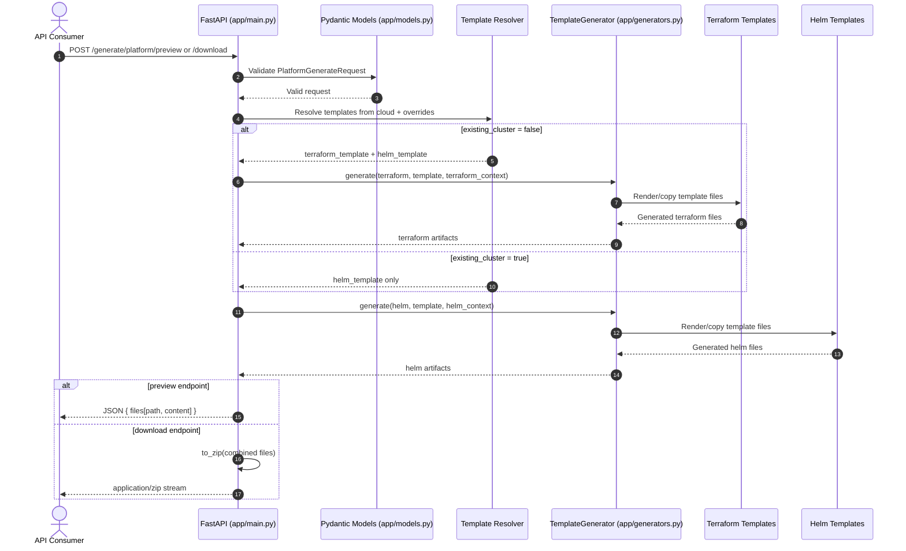

# Platform Design Document

## 1. Overview

The Terraform + Helm Generator Platform is a FastAPI service that produces infrastructure and workload artifacts from reusable templates. It supports standalone Terraform or Helm generation and a unified platform flow that combines both.

Primary outcomes:
- Standardized infrastructure/workload scaffolding.
- Cloud-aware defaults for AWS, Azure, and GCP.
- Preview and downloadable ZIP outputs for automation pipelines.

## 2. Goals and Non-Goals

### Goals
- Provide deterministic artifact generation from validated inputs.
- Support cloud-specific defaults with optional template overrides.
- Enable "existing cluster" mode for workload-only generation.
- Keep templates modular for easy extension.

### Non-Goals
- Provisioning infrastructure directly (the service generates files; it does not execute Terraform/Helm commands).
- Stateful workflow orchestration.
- Multi-tenant auth and policy enforcement in the MVP.

## 3. System Context

```text
Client/API Consumer
    |
    v
FastAPI (app/main.py)
    |
    +--> Request models + validation (app/models.py)
    |
    +--> TemplateGenerator (app/generators.py)
             |
             +--> templates/terraform/<name>/*
             +--> templates/helm/<name>/*

Outputs:
- JSON preview (files + content)
- ZIP download (artifact bundle)
```

Architecture diagram:
- [platform-architecture.png](/c:/workspace/Platform%20Engineering/docs/architecture/platform-architecture.png)

## 4. Component Design

### API Layer (`app/main.py`)
- Exposes health and generation endpoints.
- Maps cloud values to default template names.
- Coordinates platform flow logic:
  - New cluster: Terraform + Helm.
  - Existing cluster: Helm only.

### Contract Layer (`app/models.py`)
- `GenerationRequest`: template + context for single artifact type.
- `PlatformGenerateRequest`: cloud, existing cluster switch, per-domain context, optional template overrides.

### Generation Engine (`app/generators.py`)
- Discovers template files recursively.
- Renders `.j2` files with Jinja2 `StrictUndefined`.
- Copies non-`.j2` files as-is.
- Returns normalized in-memory `GeneratedFile` list.

### Packaging
- `to_zip()` writes generated files to an in-memory ZIP archive.
- Download endpoints stream ZIP bytes.

## 5. Data and Template Model

Template roots:
- `templates/terraform/<template-name>/...`
- `templates/helm/<template-name>/...`

Processing rules:
- `.j2` suffix => render and remove suffix in output path.
- Non-templated files => copied unchanged.
- Output paths normalized to `/` separators.

Default template selection:
- Terraform: `aws-eks`, `azure-aks`, `gcp-gke`.
- Helm: `basic`, `aks-basic`, `gke-basic`.
- `existing_cluster=true` skips Terraform generation.

## 6. API Design

Endpoints:
- `GET /health`
- `POST /generate/terraform/preview`
- `POST /generate/terraform/download`
- `POST /generate/helm/preview`
- `POST /generate/helm/download`
- `POST /generate/platform/preview`
- `POST /generate/platform/download`

Response modes:
- Preview: JSON list of generated files (path + content).
- Download: ZIP attachment with deterministic file layout.

Error handling:
- Missing template => `404`.
- Rendering/validation failures => `400` with failure context.

## 7. Runtime Flow

1. Client posts request payload.
2. FastAPI validates request with Pydantic.
3. Platform endpoint resolves template names from cloud + overrides.
4. Generator renders/copies matching template files.
5. Service returns either JSON preview or ZIP stream.

## 8. Security and Reliability Considerations

Current behavior:
- In-process rendering only; no shell execution.
- Strict template variable handling via `StrictUndefined` (prevents silent bad output).

Recommended improvements:
- Add authentication/authorization to generation endpoints.
- Add request size limits and rate limiting.
- Add audit logging for template names and cloud selections.
- Add schema-level validation for known context keys per template family.

## 9. Operational Guidance

Local run:
```bash
python -m venv .venv
. .venv/Scripts/Activate.ps1
pip install -r requirements.txt
uvicorn app.main:app --reload
```

Health check:
- `GET http://127.0.0.1:8000/health`

OpenAPI docs:
- `http://127.0.0.1:8000/docs`

## 10. Test Strategy

Recommended tests:
- Unit tests for template resolution and existing-cluster branching.
- Golden-file tests per template set to validate rendered outputs.
- API contract tests for preview/download endpoints.
- Negative tests for missing templates and undefined template variables.

## 11. Known Gaps and Roadmap

Known gaps:
- No persistent metadata store for generated artifacts.
- No per-template formal schema contract.
- No tenant-aware controls.

Roadmap:
1. Introduce template metadata manifests and input schema validation.
2. Add authn/authz and request governance.
3. Add signed artifact bundles and provenance metadata.
4. Add CI validation for template quality and backward compatibility.

## 12. Sequence Diagram

