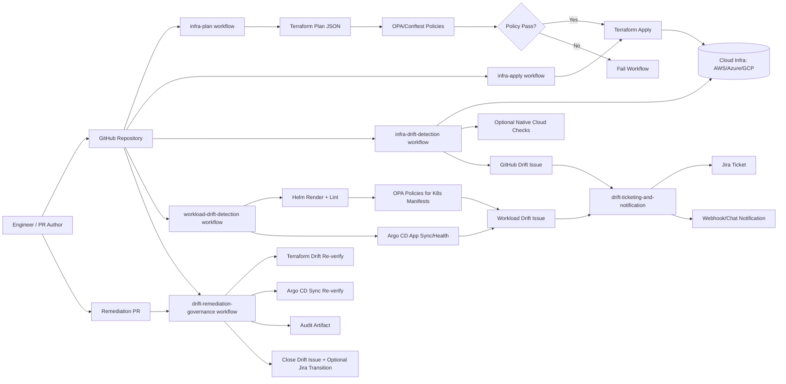
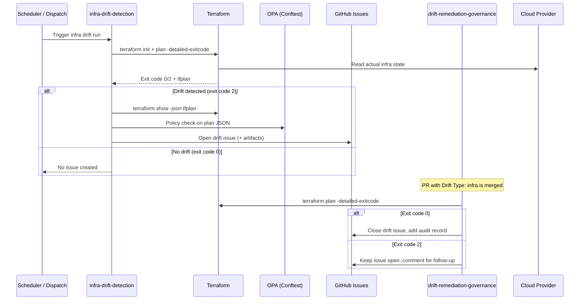
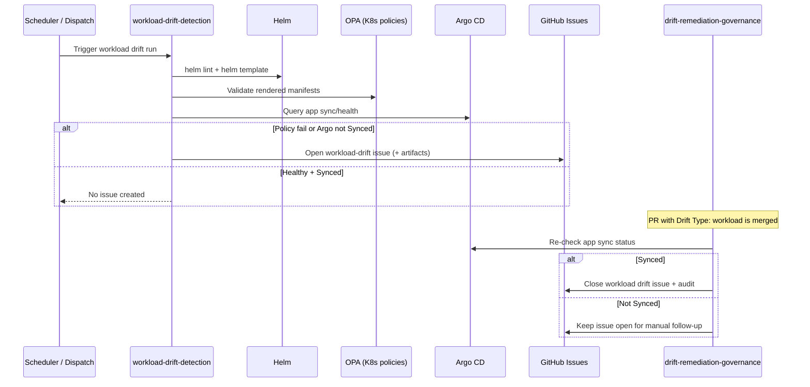

# Platform Governance Architecture (GHA + OPA + Argo CD + Drift)

This document shows how orchestration, policy enforcement, and drift remediation interact across infrastructure and workloads.

## 1) System Interaction Architecture

## 2) Infrastructure Drift Detection and Closure

## 3) Workload Drift Detection with Argo CD

