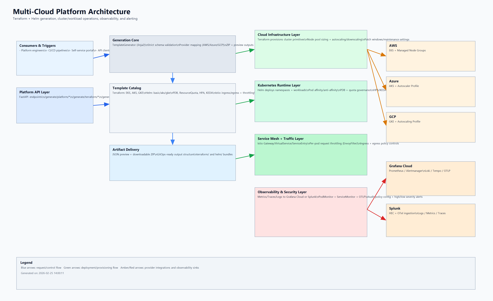

# 02 - Architecture and Components

## High-Level Architecture

## Core Components

- `app/main.py`: API endpoints and flow orchestration.
- `app/models.py`: request contracts and validation.
- `app/generators.py`: template rendering and ZIP packaging.
- `templates/terraform/*`: Terraform template families.
- `templates/helm/*`: Helm template families.

## Design Principles

- Deterministic output from explicit inputs.
- Fail fast on missing template variables.
- Keep templates modular and cloud-specific where needed.
